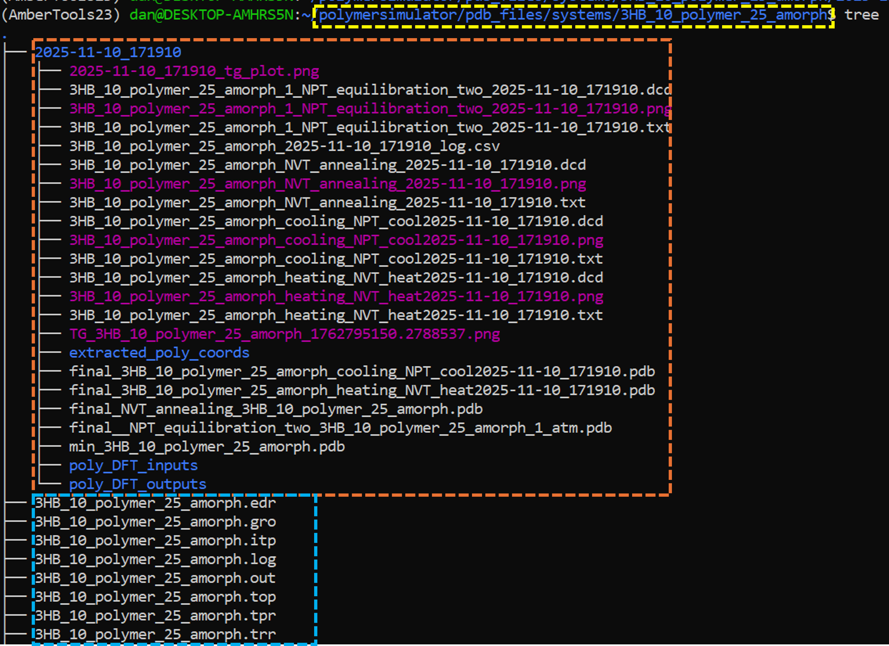
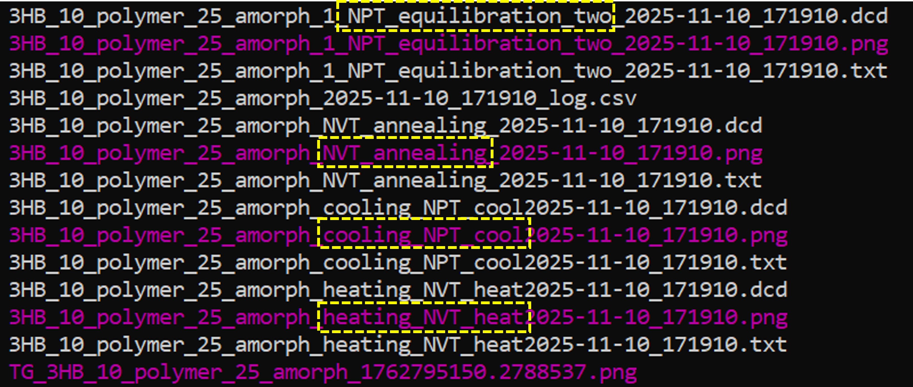

Analysing Polymer Simulations: Walkthrough
==========================================

.. important::
   All notebooks and code should be run from the home directory: **~/polymersimulator**.  
   Running code from other directories may cause issues with file paths and prevent required Python modules from being loaded.

This guide will cover how to set up and run some pre-defined analysis techniques on a polymer system after an MD simulation. It is also recommended that
you are somewhat familiar with MDAnalysis before utilising this code as it will help you understand any errors and the processes carried out in this guide.

The associated notebook can be found in the main PolymerSimulator directory and is called **Analysing_polymer_simulations_Walkthrough.ipynb**.

If you are unsure how to launch jupyter notebook, refer here: https://polymersimulator.readthedocs.io/en/latest/installation.html#launching-jupyter-notebook

.. note::
   These analysis methods are only valid for monodisperse homopolymer systems. Support for other types of systems that mix polymer types and lengths will be added in due course.

1. Setting up the analysis class
--------------------------------

To begin the workflow, a few modules need to be imported first:

.. code-block:: python

   from modules.sw_directories import *
   from modules.sw_analysis import *
   import os

**sw_directories**
   A filepath manager that can load and save different parameters for systems.

**sw_analysis**
   A module containing classes to set up analysis workflows and carry out pre-defined analysis

**os**
   Provides access to file paths and the base directory to initialize the filepath manager.

2: Initialise Manager and Polymer universe object
-------------------------------------------------

Now that the modules are loaded, two different classes — **PolySimManage** and **initialise_poly_analysis** — are used to create the **manager** and **universe** objects.

.. code-block:: python

   manager = PolySimManage(os.getcwd())

Now the manager object has been set up, it is important to note what arguments are required to set up the universe object. The universe object is a wrapper of a standard MDAnalysis universe, but it contains useful attributes specific to this analysis workflow (hence the existence of this wrapper) - the many attributes and functions will be detailed further on in this guide.

1. A finished polymer simulation
2. The name tag associated to the simulation stage you desire to analyse (see example figure below)
3. The name of your system
4. The name of your polymer in the system
5. The length of the polymers in the system
6. The type of files the simulation was launched with

As an example, files of a system called **3HB_10_polymer_25_amorph** can be found in the polymersimulator repository. This system is:

- 25 3HB decamers
- Amorphous (starting structure generated with Polyply)

Within the standard polymersimulator file structure all the files related to this system are found at **~/polymersimulator/pdb_files/systems/3HB_10_polymer_25_amorph**. Inside of this folder, various things can be found:

- Topology files
- Coordinate files
- Timestapped folders for any simulations

An example is shown below (although, bear in mind, there may be files present that you do not have due to testing and other methods not yet documented).
- Highlighted in blue are the general files for the system *(i.e. topologies and coordinates). 
- Highlighted in orange is a folder for a specific simulation and contains data files, trajectories and some output graphs. 
- Highlithed in yellow is the location of this file within the polymersimulator file structure.

It is worth explaining some of the files inside the actual simulation folder in a bit more detail:

There are are different types of files:

- **.dcd**: these are trajectory files
- **.png**: these are outputted graphs from each simulatiuon stage
- **.txt**: these are the raw data files from each simulations tage
- **.csv**: this file is the log file, it is depreceated and the contents can be ignored - but if this file exists, it means the simulation finished

These files all follow a similar naming convention:

- **3HB_10_polymer_25_amorph**: the name of the system
- **"NVT_annealing"**: this is the name of the simulation stage with other examples highlighted in yellow
- **2025-11-10_....**: this is the specific timestamp assigned to this simulation - this exists to allow for replica simulations without overwriting previously existing data.

Now that long-winded explanation is out of the way, the base line of code to initialise an analysis workflow looks like this:

.. code-block:: python

   universe = intialise_poly_analysis(manager, system_name, polymer_name, poly_len, sim_stage_name, sim_type, sim_index)

Each of these arguments is explained in the table below:

.. list-table:: Arguments for ``initialise_poly_analysis``
   :header-rows: 1
   :widths: 20 80

   * - **Argument**
     - **Description**
   * - ``manager``
     - Manager object.
       
       EXAMPLE: pre-initialised manager object.
       
       TYPE: python object
   * - ``system_name``
     - Name of the system.
       
       EXAMPLE: "3HB_10_polymer_25_amorph".
       
       TYPE: string
   * - ``polymer_name``
     - Name of the polymer.
       
       EXAMPLE: "3HB_10_polymer".
       
       TYPE: string
   * - ``poly_len``
     - Length of the polymer.
       
       EXAMPLE: 10.
       
       TYPE: integer
   * - ``sim_stage_name``
     - Name of the simulation stage to be analysed.
       
       EXAMPLE: "cooling_NPT_cool".
       
       TYPE: string
   * - ``sim_type``
     - Type of simulation files parsed to the simulation engine
       (i.e. amber or gromacs files).
       
       EXAMPLE: "GRO".
       
       TYPE: string
       
       NOTE: types currently supported are "AMB" and "GRO"
   * - ``sim_index``
     - The simulation folder you want to access.
       
       EXAMPLE: 0.
       
       TYPE: integer
       
       NOTE: Useful when you have replica universes; you can use the
       same other arguments but pass 0, 1, 2, ... here to analyse
       different instances of the same simulation.

So for the exmaple system, the section I want to analyse is the production run which contains the "cooling_NPT_cool" tag (if you want to analyse another section of the simulation, just pass a different file tag, i.e. *"NVT_annealing"*) so the arguments are as follows:

- manger = manager
- system_name = "3HB_10_polymer_25_amorph"
- polymer_name = "3HB_10_polymer"
- poly_len = 10
- sim_stage_name = "cooling_NPT_cool"
- sim_type = "GRO"
- sim_index = 0

And the line of code looks like this:

.. code-block:: python

   universe = initialise_poly_analysis(manager=manager, system_name="3HB_10_polymer_25_amorph", polymer_name="3HB_10_polymer", poly_len=10, sim_stage_name="cooling_NPT_cool", sim_type="GRO", sim_index=0)

3: Attributes of a Polymer universe object
------------------------------------------

The returned **universe** object has multiple attributes and these attributes are specific to the selected simualtion. These are shown in the table below.

.. list-table:: Attributes of a Polymer Universe Object
   :header-rows: 1
   :widths: 25 75

   * - **Attribute**
     - **Description**
   * - ``data``
     - Returns a pandas dataframe of the data from the specific stage selected to be analysed.
   * - ``data_file``
     - Path to the datafile that is used for the pandas dataframe.
   * - ``output_filename``
     - The base filename assigned to any files generated during analysis.
   * - ``sim_stage``
     - The stage of the simulation being analysed.
   * - ``topology``
     - Path to the topology file used to generate the MDAnalysis universe.
   * - ``traj_format``
     - Format of the trajectory file.
   * - ``trajectory``
     - Path to the trajectory file used to generate the MDAnalysis universe.
   * - ``universe``
     - MDAnalysis universe object.
   * - ``select_polymer``
     - Built in method to select individual polymers from the universe.
   * - ``select_backbone``
     - Built in method to select individual polymer backbones from the universe.
   * - ``masterclass``
     - An attribute that contains many more attributes (see below....).

All of these attributes can be accessed as follows:

.. code-block:: python

   universe.attribute

Whilst that list of attributes is specific to a specific instance of a simulation, you will notice the **universe.masterclass** attribute. This has its own set of attributes, that are unique to the system being analysed but are the same across all instances of replica simulations (hence, the existence of this extra nested class). The attributes for this are listed below.

.. note::
   Its a straight up lie that all of these attributes are non-specific to the simulation being analysed and are general to the system. This is the case for most of them, but some of the attributes will return items specific to the specific simulation instance - either way, it works and does actually make sense so don't think too hard!

.. list-table:: Attributes of ``universe.masterclass``
   :header-rows: 1
   :widths: 30 70

   * - **Attribute**
     - **Description**
   * - ``base_molecule_name``
     - Name of the base polymer.
   * - ``base_pdb``
     - Path to the pdb file of the base polymer.
   * - ``base_poly_vol``
     - Volume of the base polymer.
   * - ``calculate_polymers_and_assign_residue_codes``
     - TODO: description.
   * - ``extract_rescodes_and_resnums``
     - TODO: description.
   * - ``group_files``
     - Built in method that groups simulation stage files.
   * - ``manager``
     - Manger object.
   * - ``min_filepath``
     - Path to minimized structure that is generated at the beggining of the simulation.
   * - ``number_of_polymers``
     - Number of polymers in the simulation.
   * - ``poly_length``
     - Length of polymers in the simulation.
   * - ``poly_sel_dict``
     - Dictionary of polymer names you can select.
   * - ``polymer_code``
     - Prefix of the polymer name.
   * - ``residue_codes``
     - Residues codes found within the simulation.
   * - ``simulation_directory``
     - Path to the simualtion directory.
   * - ``simulation_files``
     - All files found in the simulation directory.
   * - ``simulation_stages``
     - List of potential simualtion stages that can be analysed.
   * - ``system_name``
     - Name of the system.
   * - ``system_vol``
     - Approximate volume of all atoms within the system.
   * - ``topology_file``
     - Path to the topology file used in the simulation.

All of these attributes can be accessed as follows:

.. code-block:: python

   universe.masterclass.attribute

.. _polymer-selection:

4: Selecting Individual Polymers
--------------------------------

Another important part of the analysis is being able to select individual polymers. When the universe is intialised, a dictionary is created called the **poly_sel_dict** and can be accessed for any given universe as so.

.. code-block:: python

   universe.masterclass.poly_sel_dict

This will return a dictionary with certain identifiers that are parsed to a class method to select polymers. These identifiers will differ depending on whether a GROMACS or AMBER topology was used to intialise the universe. 

For example, if a **GROMACS** topology was used the dictionary will look like this:

.. code-block:: python

   {'Polymer_1': 'A',
    'Polymer_2': 'B',
    'Polymer_3': 'C',
    ...}

But if an **AMBER** topology was used, it will look like this:

.. code-block:: python

   {'Polymer_1': [1, 2, 3, 4, 5, 6, 7, 8, 9, 10],
    'Polymer_2': [11, 12, 13, 14, 15, 16, 17, 18, 19, 20],
    'Polymer_3': [21, 22, 23, 24, 25, 26, 27, 28, 29, 30],
    ...}

The table below shows what these identifiers for each polymer are in terms of MDAnalysis atom selection syntax.

.. list-table:: **Polymer identifier codes**
   :header-rows: 1
   :widths: 20 20

   * - **Topology Type**
     - **Selection Method**
   * - Amber
     - Resids (all resids of monomers in a polymer)
   * - Gromacs
     - Segids (segid of a polymer)

This is useful to know but it is not actually important. To select a polymer, there is a class method which can be accessed as a **universe** attribute called **select_polymer**. To select a polymer atom group, the only argument is "Polymer_x". For example,

.. code-block:: python

   polymer = universe.select_polymer("Polymer_1")
   print(polymer)

Printing this variable will return the same information as if you were 'printing' an madanalysis universe.

5: Analysis class
-----------------

The **universe** object has been covered, so it is time to get into some nitty-gritty analysis methods. 

For this there is a seperate class called **Analysis**, this doesn't need to be initialised and acts as a sort of 'library' where various predefined methods can be accessed (or added to!).

These functions can be called as so:

.. code-block:: python

   Analysis.some_analysis_method

A list of accesible methods from this **Analysis** class is in progress below.

.. list-table:: **Analysis methods found in the Analysis class**
   :header-rows: 1
   :widths: 20 20

   * - **Analysis method**
     - **How to access it**
     - **Function**
     - **Arguments**
   * - Method 1
     - Attribute
     - Function
     - Arguments

5.1: ROG of a single polymer
----------------------------

To calculate the radius of gyration of a single polymer, an atom group of a polymer needs to be defined first - see :ref:`section 4 <polymer-selection>` for details. Below is an example of how to select the first polymer within a system.

.. code-block:: python

   polymer_1 = universe.select_polymer("Polymer_1")

Once a polymer has been selected it can be passed to the **plot_ROG** method built into the analysis class.

.. code-block:: python

   rog_data = Analysis.plot_ROG(universe, polymer_1)

   

