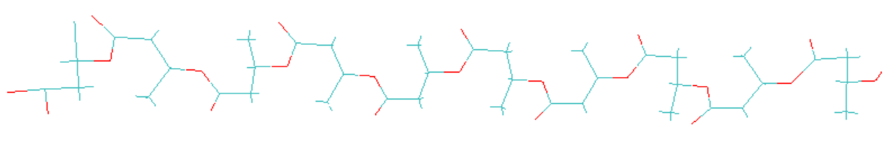
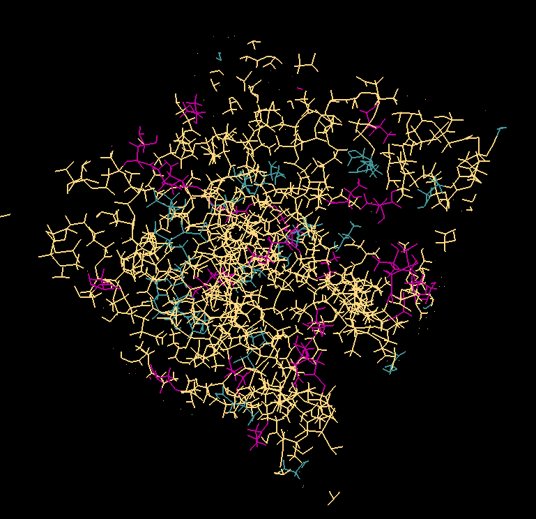

Building and Simulating Monodisperse PHAs
=========================================

.. important::
   All notebooks and code should be run from the home directory: **~/polymersimulator**.  
   Running code from other directories may cause issues with file paths and prevent required Python modules from being loaded.

This guide will cover how to build polymers and run simulations of **polyhydroxyalkanoates (PHAs)** using pre-generated parameters.

The associated notebook can be found in the main PolymerSimulator directory and is called **simulating_monodisperse_PHAs.ipynb**.

.. note::
   PHA examples provided here are intended as a starting point and parameters are provided. You can adapt the workflow to other polymer systems using the more detailed instructions later on in the documentation.

1: Taking a Look at Pre-Parameterized PHAs
------------------------------------------

Below is a list of all PHAs that are already parameterized and available upon cloning the repository.

TABLE OF PHAS

2: Load Python Modules
----------------------

To begin the workflow, a few modules need to be imported first:

.. code-block:: python

   from modules.sw_directories import *
   from modules.sw_build_systems import *
   import os

**sw_directories**
   A filepath manager that can load and save different parameters for systems.

**sw_build_systems**
   A module containing classes to build polymers, create systems, and save parameters.

**os**
   Provides access to file paths and the base directory to initialize the filepath manager.

3: Initialise Manager and Builder Objects
-----------------------------------------

Now that the modules are loaded, two different classes — **PolySimManage** and **BuildAmberSystems** — are used to create the **manager** and **builder** objects:

.. code-block:: python

   manager = PolySimManage(os.getcwd())
   builder = BuildAmberSystems(manager)

As mentioned, the **manager** is a filepath manager and the **builder** contains the methods for building polymers and preparing systems for simulations.

.. note::
   In Python, these objects are called **classes**.  
   Classes can contain **functions**, which are called **methods**, that define the behaviors of the objects (i.e. what functions do they carry out, how is the package structured).

4: Build a Polymer
------------------

With the modules loaded and the **manager** and **builder** objects initialized, a polymer can be built.

PHAs listed at the beginning of this tutorial have already been parameterized using AmberTools .

.. note::
   All PHAs have been parameterized with **GAFF2** and **abcg2** charges.  

The parameterization process at a glance:

1. Build a trimer  
2. Parameterize the trimer  
3. Create **head**, **mainchain**, and **tail** units for the trimer  
4. Save these units in files so polymers can be built 

.. note::
   Parameterizing polymers with the polymersimulator is explained in more detail in other parts of this documentation. Please refer to it for projects where the parameters for different polymers do not already exist.

To build a polymer, two things are required:

**name of the base trimer**
   For any given polymer, this is: {prefix}_trimer ; where the prefix is the name of the polymer (i.e. 3HB)

   *Examples: "4HB_trimer", "3HB_trimer", "3HHp_trimer"*
   
**The desired length of the final polymer**
   The number of monomers required in the final polymer (i.e 10)

Assign these variables in Python:

.. code-block:: python

   polymer_base_name = "3HB_trimer"
   number_of_units = 10

Pass these variables to the **gen_polymer_pdb_and_params** method of the builder object and assign the output to a variable called **polymer**:

.. code-block:: python

   polymer = builder.gen_polymer_pdb_and_params(
       base_name=polymer_base_name,
       number_of_units=number_of_units
   )

.. note:: 
   If you are familiar with Python, you will notice you can pass the **polymer_base_name** and **number_of_units** directly to the function. They are defined separately here for clarity.

5: Outputs from Building a Polymer
----------------------------------

The variable **polymer** contains three outputs:

1. PDB filepath of the built polymer  
2. Amber topology filepath of the built polymer  
3. Amber coordinate filepath of the built polymer

These outputs can be examined as follows and will provide filepaths to the generated files:

.. code-block:: python

   print(f"""
      Polymer built using units parameterized for: {polymer_base_name}

      The PDB file can be found at: {polymer[0]}
      The Amber topology file can be found at: {polymer[1]}
      The Amber coordinate file can be found at: {polymer[2]}""")

For the example of 3HB, the final polymer can be visualized in VMD from the PDB file and should look similar to this:

.. note::
   These new files for the contstructed polymer will be in their own folder:  
   **~polymersimulator/pdb_files/systems/3HB_10_polymer**  

   The files for building the polymer units can be found at: **~polymersimulator/pdb_files/molecules/3HB_trimer**

5.1: Polymer Naming Conventions
-------------------------------

All PHAs are parameterized from trimers (e.g., `"3HB_trimer"`, `"4HB_trimer"`, etc.).  

Built polymers follow the naming pattern:

.. code-block:: none

   {prefix}_{number_of_units}_polymer

For example, using a 3HB trimer with 10 units, the polymer name will be:

.. code-block:: none

   3HB_10_polymer

5.2: Loading Polymer Files
--------------------------

While not critical to this guide, it is useful to understand how to load individual polymer files.  

Continuing with **"3HB_10_polymer"**, the  pdb files and amber topology/coordinate files can be loaded using the **manager** object:

.. code-block:: python

   polymer_name = "3HB_10_polymer"
   pdb = manager.load_pdb_filepath(polymer_name)
   amb_top, amb_coord = manager.load_amber_filepaths(polymer_name)

These variables can then be examined similarly to before:

.. code-block:: python

   print(f"""
      Polymer built using units parameterized for: {polymer_name}

      The PDB file can be found at: {pdb}
      The Amber topology file can be found at: {amb_top}
      The Amber coordinate file can be found at: {amb_coord}""")

This method works for all polymers, molecules, and systems. Only the name needs to be passed to the appropriate method in the filepath manager.

6: Building Amorphous Systems of Polymers
-----------------------------------------

The next step is to build an amorphous system of polymers with **Polyply**.  
There is one issue with the current setup: the polymers were parameterized and built with **AmberTools**, but **Polyply** was developed to be used with **GROMACS**. This means the current topologies are in the wrong format and a conversion to GROMACS file formats is required.

6.1: Converting Amber Topologies to GROMACS
-------------------------------------------

AmberTools has a module called **acpype** which can convert topologies from Amber → GROMACS format. 

.. note::
   A more detailed explanation of Amber → GROMACS conversion will be added to the in-depth documentation.  
   A function has been implemented in PolymerSimulator for running this conversion esaily, which is what is demonstrated in this quickstart guide.

The function only requires inputs that have already been defined:

- Polymer name  
- Polymer topology  
- Polymer coordinates

This conversion is carried out with:

.. code-block:: python

   builder.run_acypype(name=polymer_name, top=amb_top, coord=amb_coord)

6.2: Building a System with Polyply
-----------------------------------

.. note::
   A more detailed explanation of this function will be added to the documentation.  
   For this quickstart guide, only the usage of the function is demonstrated.

Once the polymer has been converted to GROMACS format, multiple instances of this polymer can be packed using Polyply.  
A function called **run_polyply** within the builder object performs this task.  

The arguments required are a list of polymer names and a corresponding list of the number of each polymer.  

For example, to pack a system of **25 3HB_10_polymers**, use:

.. code-block:: python

   polymer_names = ["3HB_10_polymer"]
   number_of_polymers = [25]

These can be passed to the function as follows:

.. code-block:: python

   system_name, gro_top, gro_coord, gro_itp = builder.run_polyply(
       polymer_names=polymer_names,
       num_poly=number_of_polymers
   )

There are additional optional arguments, but they are not covered in this quickstart guide.  
The system will be generated with a density of 0.75 g/mL by default.

The final system, visualised in vmd, will look similar to this:

6.3 Issues with polyply starting systems
----------------------------------------

When running a simulation with a system generated with polyply, a common error is encountered:

.. code-block:: python

   OpenMMException: Particle coordinate is NaN.  For more information, see https://github.com/openmm/openmm/wiki/Frequently-Asked-Questions#nan

This error typically occurs because atoms are too close to eachother and create massive repulsive forces (leading to a near infinite term for these forces in the Lennard-Jones potential). This is an artifact from the polyply packing process. The polymers are packed coarsely as minimized representations before being expanded during energy minimization. 

.. container:: images-side-by-side

   .. image:: images/polyply_out.PNG
      :width: 45%
      :align: left

   .. image:: images/polyply_em.PNG
      :width: 45%
      :align: right

In the above images the **left** shows the polyply output and the condensed polymers. On the **right**, after energy minimization, this is what the final polymer system looks like. Due to this minimized representation --> packing --> expansion approach, there can be some unwanted steric clashes within the system leading to a system that produces a NaN error. This effect is non-existent at very low denstities but quickly becomes an issue when trying to pack high-density systems. With this in mind, a default target of a system with 0.75 g/ml density is given as the desired structure.

To avoid this, a series of extremely short simulations can be carried wtih the **builder.find_polyply_starting_structrue** method. The outputs are the same as **builder.run_polyply** to avoid any confusion - except the generated files have been succesfully used to run an openmm simulation.

.. note::
   Test this in your own pc with a very small system. Issues should only be encoutnerred with extremely large systems but it is always worth it to be sure.
