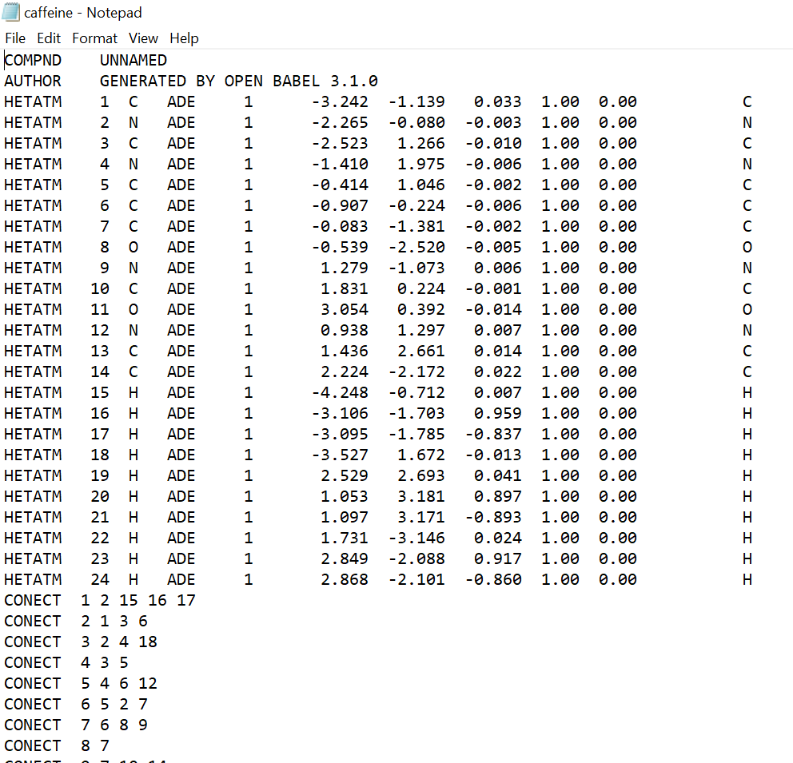

sw_build_systems tutorial
=========================

This module is the basis for almost all of the tasks carried out by other modules in this package. It relies on the **SnippetSimManage** class in the **sw_directories** module
for a lot of file finding//directing. 

The second and third tutorials (**tutorial_2_build_systems** and **tutorial_3_solvating_small_molecules**) provides a nice introduction into how to use this module and carry out of ranging of tasks related to building molecules and generating amber files for molecular dynamics.

This module consists of 2 classes; **BuildSystems** and **BuildAmberSystems**.

Initialising an instance of BuildSystems
----------------------------------------

The **BuildSystems** class gives access to a range of standard functions. Before going through some examples lets intialise an instance of this class, to do
this, an instance of the **SnippetSimManage** class will also have be initiated as explained in the **sw_directories tutorial**.

.. code-block:: python

   from modules.sw_directories import *
   from modules.sw_build_systems import *
   import os as os

   manager = SnippetSimManage(os.getcwd())
   builder = BuildSystems(manager)

Building molecules with BuildSystems
------------------------------------

The next stage is to build a molecule with the instance of **BuildSystems**. To do this a SMILES string and a name are required, for the purposes of the tutorial lets build caffeine. It SMILES string is: **CN1C=NC2=C1C(=O)N(C(=O)N2C)C**.

.. code-block:: python

   builder.SmilesToPDB("CN1C=NC2=C1C(=O)N(C(=O)N2C)C", "caffeine")

The arguments of this function are:

.. code-block:: python

   builder.SmilesToPDB(SMILES, path_to_generated_pdb_file)   

This class method will generate a .pdb file containing a molecule associated with the SMILES string saved at the specified location. 
So in the example above, a file called **caffeine.pdb** will now exist in my home directory. This function doesn't send any files to correct places
as it is intended as a test to see if your desired molecule can be built.

The alternative way to build a molecule is the one you will want to use instead as it will create a directory for your molecule and save a .pdb file there
in addition to generating a unique residue code for it.

.. code-block ::python

   pdb_file = builder.SmilsToPDB_GenResCode("CN1C=NC2=C1C(=O)N(C(=O)N2C)C", "caffeine")

For this function the only arguments the SMILES and name of a molecule:

.. code-block:: python

   pdb_file = builder.SmilesToPDB(SMILES, molecule_name)   
   print(pdb_file)

We do not need to specify a filepath for the pdb file to be saved in the correct place as when we initialised an instance of the BuildSystems class, all of the information from the filepath manager was also passed to it.

There are a couple of useful things we can now do with the manager instance:

.. code-block:: python

   pdb_file = manager.load_pdb_filepath("caffeine")
   res_code = manager.retrieve_rescode("caffeine")
   print(f"The residue code for caffeine is {res_code} and the path to the associated pdb file is {pdb_file}")

You can also open the pdb file and see that the rescode in the pdb file matches the one printed above.

The residue code information will now be stored in the residue code csv file which is located:

.. code-block:: python

   print(manager.residue_code_csv)

Other functionality of BuildSystems
-----------------------------------

The meat of this module is contained in the next class, but before moving on to that, there is some other functionality of the **BuildSystems** class.

Finding largest distances between points in an .xyz or .pdb file
----------------------------------------------------------------

The maximum distance between points in all 3 plance can be returned with the following class method.

.. code-block:: python

   x,y,z = builder.get_xyz_dists(pdb_file)
   print(x,y,z)

This function requires a pdb filepath (or xyz filepath) so you can use one the methods shown above that return the entire path to the pdb file.
This is useful when determining the sizes of organised systems contaiing many molecules and when generating periodic box vectors for a molecular dynamics simulation.

Aligning a molecule in a plane
------------------------------

A molecule can be aligned in a plane with the following class method.

.. code-block:: python

   # Can be "X"/"Y"/"Z"
   pdb_file = builder.align_molecule(pdb_file, "Z") 

This function requries a pdb filepath and a specification of what plane you want to align the molecule in. It utilises a principal axis calcualted in mdanalysis and 
rewrites the pdb file. You will want to check your pdb file visually as the results are not foolproof and the calculated principal axis may not always be as expected.
This function will return the original path of the pdb file, so you can keep working as seamlessly as possible.

Other
-----

There will be some other class methods you may see in the documentation that you can ignore for some cases. First of all, any instance of **BuildSystems**
will have a **manager** attribute, and this is everything from the **SnippetSimManage** class and this allows buildsystems to send and retireve files, but you could
technically do anything you could do with the manager instance with the builder instance as so:

.. code-block:: python

   builder.manager.some_method_or_attribute

There is also a class method that runs packmol that is called as follows:

.. code-block:: python

   builder.run_packmol(input_filepath)

However, you will need packmol configured in your pc (or hpc facility) to use this and this emulates the typical packmol command you would normally run the shell.

There are also a series of class methods related to handling residue codes and ensuring none are overwritten or duplicated, you can ignore these as these take place in the background when building molecules with unique residue codes.

Initialising an instance of BuildAmberSystems
---------------------------------------------

The second class is **BuildAmberSystems** and inherits all of the functionality from its parent **BuildSystems** class and anything you can do with **BuildSystems** is also possible with **BuildAmberSystems**.
This class is the proliferator of systems for molecular dynamics. It is recommended to follow **Tutorial_3_build_amber_systems**.
The first thing to do is initialise an instance of the class - this is the exact method as for **BuildSystems* but using **BuildAmberSystems** instead.

.. code-block:: python

   from modules.sw_directories import *
   from modules.sw_build_systems import *
   import os as os

   manager = SnippetSimManage(os.getcwd())
   builder = BuildAmberSystems(manager)

Parameterizing a molecule
-------------------------

The next stage is to parameterize a molecule for molecular dyanmics with amber. Before actually parameterizing it charges to need to be assigned to each atom
in the molecule. This file with the charges is a '.ac' file and it is essentially a '.pdb' file with an extra notation for the charges of each atom.

.. code-block:: python

   ac_file = builder.gen_ac_file("caffeine")
   print(ac_file)

The only argument for this class method is the name of the molecule being parameterized - due to the manager object (an instance of **SnippetSimManage**) being
passed to **BuildAmberSystems** it can find the directory easily. The filepath of the .ac file is also returned, but it is not required for anything other than ensuring the file exists and has actually been generated.

The next step is to parameterize caffeine.

.. code-block:: python

   builder.parameterize_mol("caffeine")

This class method doesnt return anything but there is a way to check if the molecule was parameterized.

.. code-block:: python

   param = builder.is_mol_parameterized("caffeine")
   print(param)

If it has been succesfully parameterized **True** will be printed and **False** if it has not been. This class method could be integrated into some automatic methods
and provide an instance to catch any errors in parameterization. You will only ever need to parameterize each molecule once and **warning** for larger molecules
this process will take significantly longer.

*Note: you may be a bit confused at this point as to where the polymers are...! That will be the next, but first it is critical to understand the functionality of each module and build understanding in a useful way.*

Generating amber parameter files for a single molecule
------------------------------------------------------

To run an amber simulation a topology and coordinate is required and this needs to be built using the parameter files. A class method exists
to carry out the generation of these files automatically.

.. code-block:: python

   system_name = builder.gen_amber_params_sing_mol("caffeine")
   print(system_name)

This will generate the topology and coordinate files for a single molecule of caffeine, this step may seem unnecessary as the parameters for caffine already exist
but this stage is required to generate periodic boundary conditions for the molecule. The system name will be printed and can be used to retrieve the files for molecular dyanmics simulation.
The system name in this example is **caffeine_sing_mol** and other class methods that build systems will return appropriately named systems.

.. code-block:: python

   top, coord = manager.load_amber_filepaths(system_name)
   print(f"The topology file for {system_name} is {top}")
   print(f"The coordinate file for {system_name} is {coord}")

The system will be a single caffeine molecule.

INSERT PIC

Generating amber parameter files for a single molecule solvated in water
------------------------------------------------------------------------

To generate amber parameters for a small molecule solvated in water, the procedure is very much the same, but a different class method is called.

.. code-block:: python

   system_name = builder.gen_amber_params_sing_mol_solvated("caffeine")

The amber files can be found using the system name in the same way as before. This system will be called **caffeine_wat_solv**. There is another consideration here though.
This class method will create pariodic box where the molecule exactly fits and solvate the free space. However, you may want to add a buffer of water around your molecule.
This is done by adding another argument to the class method above.

..code-block:: python

   system_name = builder.gen_amber_params_sing_mol_solvated("caffeine", 10)

This will add a buffer of water 10 angstroms around the caffeine molecule and this system will be called **caffeine_wat_solv_10** and, again, the amber files can be retrieved as so.

..code-block:: python

   top, coord = manager.load_amber_filepaths(system_name)
   print(f"The topology file for {system_name} is {top}")
   print(f"The coordinate file for {system_name} is {coord}")

INSERT PIC

Building polymers
-----------------

The next stage is to build and parameterize some polymers. This is a bit more complicated that a single molecule as the approach here is a **building block** approach.
The idea is to split a trimer of the polymer into a **head**, **mainchain** and **tail** unit and then concateneate these together into a larger polymer.
This method has an advantage in the parameterization of a large polymer as we start with a parameterized trimer - meaning all 3 units of the polymer are parameterized.

The initial step to generating a parameterized polymer is the same as with a small molecule - we must generate the trimer with a unique rescode.

.. code-block ::python

   pdb_file = builder.SmilesToPDB_GenResCode("OC(C)CC(=O)OC(C)CC(=O)OC(C)CC(=O)O", "3HB_trimer")
   print(pdb_file)

Then we need to generate the .ac file and parameterize the mol in the same way as was done for caffeine.

.. code-block:: python

   ac_file = builder.gen_ac_file("3HB_trimer")
   print(ac_file)
   builder.parameterize_mol("3HB_trimer")

The next stage is to use a class method to generate residue code for the polymer units (head, mainchain and tail unit). For example, if your trimer was
assigned the rescode **AAA** the head, mainchain and tail will be asigned **hAA**, **mAA** and **tAA** as their res codes.

..code-block:: python

   builder.GenRescode_4_PolyUnits("3HB_trimer")

This will print the new associated rescodes - however, this class method will not return any information as all of the info is now saved in the residue_codes.csv.
The reason for assigning rescodes to each unit is critical for the building of polymers as these codes can be made into patterns that say how many units are in each polymer.

The next step is generate amber parameter files **.prepi** files for each unit. Their is a prerequisite of creating a file for the head, mainchain and tail unit denoting
what atoms make up each unit and saving it in the appropriate directory (i.e. **home/pdb_files/molecules/3HB_trimer/head_3HB_trimer.txt**). An explanation of that will come in the future but for now I will point you to the amber tutorial for generating these files for PET trimer https://ambermd.org/tutorials/advanced/tutorial27/pet.php .
However, example files denoting what atoms are in each unit of a 3HB_trimer can be found in the github.

..code-block:: python

   builder.gen_prepin_files("3HB_trimer")

If this line executes and there are no errors (there will likely be some on the first try) we can proceed with building polymers. The class method to build polymers is very simple,
the arguments are the base_trimer followed by the number of units you desire you polymer to have.

..code-block:: python

   pdb = builder.gen_polymer_pdb(base_trimer, number_of_units)

For example if I wanted to build a 3HB decamer (10 units), I would run this:

..code-block:: python

   pdb = builder.gen_polymer_pdb("3HB_trimer", 10)
   print(pdb)

This will also return the path to the pdb file. There is one thing to note here, whenever you generate a polymer from its base trimer, the files for the new polymer
will be saved as in the systems directory and not the molecules directory. This polymer will be saved as **3HB_10_polymer**. 

Generaing amber parameters for a single polymer
-----------------------------------------------

Currently, the same methods that were used to generate amber parameters for caffeine and a water solvated caffeine molecule do not work for generated polymers.
This is something that will added if it is required at any point.

Building polymer systems - arrays
---------------------------------

Now a polymer is parameterized systems can be built that contain multiple polymers so bulk properties can be investigated. The basis for generating polymer systems
is to build ordered arrays of either 3x3 or 5x5 of the polymer. This can be an ordered array or a random array (so this one isn't really an array at all!).

There are some issues when running simulations of the 3x3 polymers - especially when the polymer is small. In molecular dynamics a cut off distance for long range interactions
is specified (normally 10 angstroms or 1 nanometre) and in a small system it can be less than 20 angstroms in size in one direction. This means that if you select any atom, within 
10 angstroms of itself it will see itself and the simulation will break. This is just something to be aware of if you are trying to build 3x3 array systems.

The code for generating these systems is rather simple:

..code-block:: python

   builder.generate_polymer_3_3_array(base_trimer_name, polymer_name, crystalline//random)
   builder.generate_polymer_5_5_array(base_trimer_name, polymer_name, crystalline//random)

For context, there are 2 class methods for both the 3x3 array and 5x5 array (so 4 in total) that build either a crystalline or random array. These are called by the above class method
based on whether you specified "crystalline" or "random". It should also be noted that the random array generation calls packmol so this may not work if packmol or your packmol path are 
not configured correctly.

As an example with the 3HB decamer, a crystalline and random 5x5 array will be built.

..code-block:: python

   system_name = builder.generate_polymer_5_5_array("3HB_trimer", "3HB_10_polymer", "crystalline")
   print(system_name)
   system_name = builder.generate_polymer_5_5_array("3HB_trimer", "3HB_10_polymer", "random")
   print(system_name)

The system names for 3HB decamer systems will be **3HB_10_polymer_5_5_array_crystal** and **3HB_10_polymer_5_5_array_random**. The amber files can be retrieved for these just as before.

..code-block:: python

   top, coord = manager.load_amber_filepaths(system_name)
   print(f"The topology file for {system_name} is {top}")
   print(f"The coordinate file for {system_name} is {coord}")    

Other
-----

If you look in the dropdown list on the left, there are a lot of other functions contained in this module. Many of these are usable but never really went anywhere
so lack explanation in this tutorial. In the future this statement may be redundant as functions will either be documented fully or removed.

Summary
-------

The **BuildAmberSystems** class in the **sw_build_systems** module generates amber parameters for single molecules, solvated single molecules and systems of polymers. It also generates
parameters for single molecules and polymers in addition to having the capability to be able to build polymers of any length. All of the funcionality of the **BuildSystems** module
is inherited here so any class method or attribute found in the **BuildSystems** class is also accesible via an instance of the **BuildAmberSystems** class.   

   
   