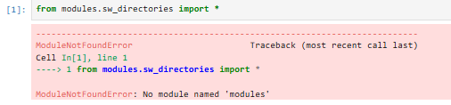
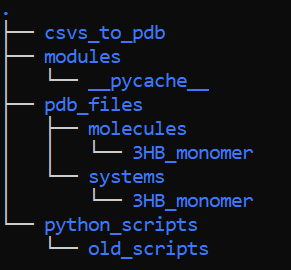
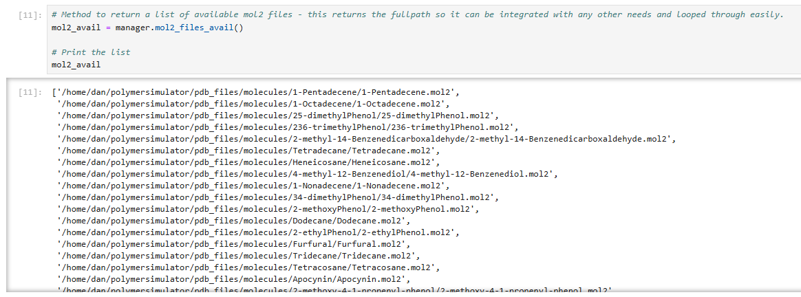
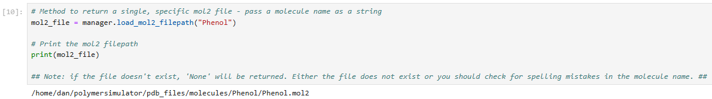

sw_directories guide
====================

This module is the workhorse of the package and ensures every file is sent to the correct place and each file can be found for its required purpose.

It is recommended that you launch and follow **tutorial_1_filepath_manager** with jupyter notebook to get a handle on how this module works and for a more comprehensive explanation of how this module works.

*Note: this is the first of many class based modules in this package so it may be useful to familiarise yourself with python classes with this video `link text <https://www.youtube.com/watch?v=ZDa-Z5JzLYM>`_

Intialising an instance of the filepath manager
-----------------------------------------------

A python class works by initialising an instance of itself. The class in **sw_directories** is **SnippetSimManage** (this was going to be the name of package but the package stays as 'polymersimulator'
in relation to wasted time thinking of names and my absence of ability to think of more apt name - you are stuck with this mismatch in name between the most important class and the package name).

Before intilialising the instance of filepath manager (**SnippetSimManage**) it is important to be in the main directory of the project after cloning the project. This main directory will have a subdirectory called **modules**.
This is **extremely important** as this class will intialise a series of subdirectories to store files generated with this code and running it another directory will create directories in the wrong place.

To intialise an instance of **SnippetSimManage** in jupyter notebook or the python interpreter you must pass the base directory path to **SnippetSimManage** which is generated with **os.getcwd**.

.. code-block:: python

   from modules.sw_directories import *
   import os as os
   main_dir = os.getcwd()
   manager = SnippetSimManage(main_dir)

If you see the following:

This means that you are launching your jupyter notebook or python interpreter from the main directory and you **must** navigate to that directory before continuing.

To quickly explain an instance of a class in python, it is an individual object created from that class. It contains specific data (attributes) and can perform actions (methods) defined by the class.

Filepath manager attributes
---------------------------

If you executed the code above, you will have an instance of the **SnippetSimManage** class called **manager**. To use this instance you will want to call **manager.some_method** or **manager.some_attribute**.
An **attribute** is a variable stored in the class and a **method** is a python function contained within the class - if you are not familiar with python functions, watch this video **right now** https://www.youtube.com/watch?v=9Os0o3wzS_I&t=50s.

As mentioned above (somehwhere) this class creates some subdirectories, the paths to all of these are stored within the instance and can be found with:

.. code-block:: python

   manager.main_dir
   manager.python_script_dir
   manager.pdb_file_dir
   manager.csv_to_pdb_dir
   manager.molecules_dir
   manager.systems_dir
   manager.residue_code_csv

These directories and files found by the code lines above will be in a directory tree that looks similar to the one below:

Each of these directories has a specific function:

- **main_dir**: this is the base directory of the project
- **python_script_dir**: this is a place to store pythons scripts; however, it is rather redundant with how the module works
- **pdb_file_dir**: this is the place where the **molecules_dir** and **systems_dir** are found. The name of this directory is a bit misleading as it contains a lot more than just pdb files, but it was initially called "pdb_file_dir" and I am wary to change it in fear of breaking something in the code.
- **csv_to_pdb_dir**: the directory where a csv file of molecule names and smilestrings can be kept for building them, a little redundant unless you are doing high-throughput system building
- **molecules_dir**: the directroy where files for individual molecules are kept (i.e. pdb_files, amber_files, etc..)
- **systems_dir**: the directory where files for systems constructed are kept (i.e. pdb_files, amber_files, etc..)
- **residues_code_csv**: an important file where unique residue codes are stored for each molecule. The use of this will become clear when you build some molecules.

Loading and showing available files
-----------------------------------

The filepath manager can show many different types of avaialable files and load specific filepaths.
To show avaialable files there are a range of class methods that are called as below.

.. code-block:: python

   manager.ac_files_avail()
   manager.amber_systems_avail()
   manager.mol2_files_avail()
   manager.pckml_files_avail()
   manager.pdb_files_avail()
   manager.simulations_avail()

Calling one of these methods will print every available file of that type, as an example:

*Note: these functions search the **manager.molecules_dir** and **manager.systems_dir** for avaialable files.*

Printing available files is potentially pointless (but a nice addition to the user experience) and the real usefulness comes from being able to load files for a specifc molecule or system with a single line of code.

.. code-block:: python

   filepath = manager.load_amber_filepaths(name)
   filepath = manager.load_mol2_filepath(name)
   filepath = manager.load_packml_filepath(name)
   filepath = manager.load_pdb_filepath(name)
   filepath = manager.load_files_for_MDanalysis(name)

These class methods use a single argument (**name** - which is the name of build molecule or system) and return the filepath that can be assigned to a varaible.

An example of loading the filepath for the mol2 file for phenol is shown below.

There are a couple of other class methods in the filepath manager:

- **manager.bash_submission()** : does nothing, a placeholder for future
- **manager.packmol_path** : returns the path to packmol in your pc (or hpc facility), if you want to use packmol you will need to configure this in the source code
- **manager.unpack_csv(csv_file)** : a function that will unpack a csv file that contains molecule names and smilestrings into two lists.

Other classes
-------------

Everything critical to the performance of the module has been explained and is found in the class **SnippetSimManage**. However, you may notice that there are 2 other classes in this module:

- **BioOilDirs**
- **DFT_manager**

Documentation besides docstrings will not be added for these for the forseeable future and these may be eventually wrapped into another, dedicated module. They are not required for the builing or simulation of polymer systems for molecular dyanmics.

Summary
-------

This module itself doesn't carry out any tasks that are particularly cool or useful to your project but it is the most **important** in terms of keeping every file organised
and 'findable'. A lot of the time, an instance of **SnippetSimManage** will be passed to another class or function and the file handling will be carried out for you. However, learning how
it works will allow you to add your own functionality and the ability to direct files where you desire with relative ease.
