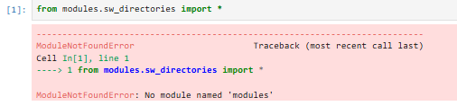

sw_directories tutorial
=======================

This module is the workhorse of the package and ensures every file is sent to the correct place and each file can be found for its required purpose.

It is recommended that you launch and follow *tutorial_1_filepath_manager* with jupyter notebook to get a handle on how this module works.

*Note: this is the first of many class based modules in this package so it may be useful to familiarise yourself with python classes with this video https://www.youtube.com/watch?v=ZDa-Z5JzLYM*

Intialising an instance of the filepath manager
-----------------------------------------------

A python class works by initialising an instance of itself. The class in **sw_directories** is **SnippetSimManage** (this was going to be the name of package but the package stays as 'polymersimulator'
in relation to wasted time thinking of names and my absence of ability to think of more apt name - you are stuck with this mismatch in name between the most important class and the package name).

Before intilialising the instance of filepath manager (**SnippetSimManage**) it is important to be in the main directory of the project after cloning the project. This main directory will have a subdirectory called **modules**.
This is **extremely important** as this class will intialise a series of subdirectories to store files generated with this code and running it another directory will create directories in the wrong place.

To intialise an instance of **SnippetSimManage** in jupyter notebook or the python interpreter you must pass the base directory path to **SnippetSimManage** which is generated with **os.getcwd**.

.. code-block:: python
   :emphasize-lines: 2

   from modules.sw_directories import *
   import os as os
   main_dir = os.getcwd()
   manager = SnippetSimManage(main_dir)

If you see the following:

This means that you are launching your jupyter notebook or python interpreter from the main directory and you **must** navigate to that directory before continuing.

To quickly explain an instance of a class in python, it is an individual object created from that class. It contains specific data (attributes) and can perform actions (methods) defined by the class.

Filepath manager attributes
---------------------------

If you executed the code above, you will have an instance of the **SnippetSimManage** class called **manager**. To use this instance you will want to call **manager.some_method** or **manager.some_attribute**.
An **attribute** is a variable stored in the class and a **method** is a python function contained within the class - if you are not familiar with python functions, watch this video **right now** https://www.youtube.com/watch?v=9Os0o3wzS_I&t=50s.

As mentioned above (somehwhere) this class creates some subdirectories, the paths to all of these are stored within the instance and can be found with:

.. code-block:: python
   :emphasize-lines: 2

   manager.main_dir
   manager.python_script_dir
   manager.pdb_file_dir
   manager.csv_to_pdb_dir
   manager.molecules_dir
   manager.systems_dir
   manager.residue_code_csv

PUT IMAGE OF TREE AND SAY SOME ARE MORE USEFUL THAN OTHERS

