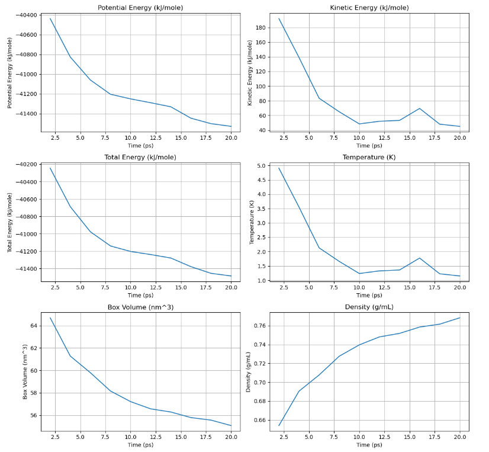

sw_openmm tutorial
==================

**sw_openmm** carries out molecular dynamics simulations. It uses the openmm python module and supports:

- Amber Simulations
- ANI simulations

However, whilst documentation is available for both, written explanations are only available in this documentation for openmm simulations that use Amber files due to ongoing issues with ANI.

This module requires an Amber topology and coordinates file to work and these are generated by the **sw_build_systems** module.
It is recommended that you launch and follow *tutorial_5_running_openmm_simulations*.

Initialising a simulation
-------------------------

The first step is to import the relevant modules and intialise the filepath manager:

.. code-block:: python

   from modules.sw_openmm import *
   from modules.sw_directories import *
   import os as os
   main_dir = os.getcwd()
   manager = SnippetSimManage(main_dir)

To initialise a simulation, 2 things are required:

- Amber files (topology and coordinates)
- Filepath manager

If you followed the tutorial_x_building_systems you should have amber files for simple molecules. Lets load these files for caffeine and set up a simulation.

.. code-block:: python
   :emphasize-lines: 2

   top, coord = manager.load_amber_filepaths("caffeine")

This returns two variables **top** and **coord**. If you generated the files properly you can print these variables and they will return the path the associated files.

.. code-block:: python
   print(top, coord)

To intialise a simulation object call **AmberSimulation** and pass the, filepath manager object, topology file and coordinate file to it.

.. code-block:: python

   simulation = AmberSimulation(manager, top, coord)

*Note: **AmberSimulation** is being called, but **sw_openmm** includes two other classes; **ANISimulaiton** and **BuildSimulation**. It is important to note that **BuildSimulation** is the main class and **ANISimulation**//**AmberSimulation** simply provide this class with the necessary set up procedures based on the files passed to them.*

Minimizing energy in a simulation
---------------------------------

With the simulation object intialised, it is time to minimize the energy. 
To do this, call the method **minimize_energy()** from the initial simulation object.
A new variable needs to be assigned so the output can be passed to another simulation function - this new variable should be named appropriately (i.e. **minimized_sim**).

.. code-block:: python

   minimized_sim = simulation.minimize_energy()

This line of code will retun an openmm simulation object which is called **minimized_sim**, these variables from class methods that carry out different molecular dynamic steps are what will be passed to the next molecular dynamics function.

Running basic NVT//NPT ensembles
--------------------------------

The meaning of **basic** here implies a static NVT or NPT simulation. For example, there are functions that change the change the pressure and temperature in the simulation over time,
but these **basic** functions use a set of static parameters. For **NVT** the static parameters are; **N**: Number of particles, **V**: Volume and **T**: Temperature. When carrying out an NVT simulation the temperature (in Kelvin) is input and N//V are found from the openmm simulation object that is passed to the function.
For **NPT** these static parameters are ; **N**: Number of particles, **V**: Volume and **P**: Pressure. When carrying out an NPT simulation the pressure (in atmospheres) and temperature (in kelvin) is inut and N is found from openmm simulation object that is passed to the function.

To carry out a basic NVT//NPT using the initial minimized system is simple:

.. code-block:: python

   NPT_sim, NPT_sim_data = simulation.basic_NPT(minimized_sim, 1000000, 1.0, 300)

Or for an **NVT_simulation**:

.. code-block:: python

   NVT_sim, NVT_sim_data = simulation.basic_NVT(minimized_sim, 10000000, 300)

The arguments for the **basic NVT//NPT** simulations are as follows:

.. code-block:: python

   NPT_sim, NPT_sim_data = simulation.basic_NPT(openmm_simulation_object, total_steps, pressure, temperature)
   NVT_sim, NVT_sim_data = simulation.basic_NVT(openmm_simulation_object, total_steps, temperature)

It is important to note that 2 variable are returned by **basic_NPT//NVT**:

- **NPT_sim**: The simulation object that can be passed to the next stage of the simulation
- **NPT_sim_data**: The path to the data file generated from this stage of the simulation.

The data can be visualised with another class method:

.. code-block:: python

    simulation.graph_state_data(NPT_sim_data)

This will return some graphs that look something like this:

The power of these methods comes from the output being able to be passed straight to another class method. For example, if you started with an energy minimization and ran a basic NPT simulation - you could then run a basic NVT simulation with minimal effort.

.. code-block:: python

   minimized_sim = simulation.minimize_energy()
   NPT_sim, NPT_sim_data = simulation.basic_NPT(minimized_sim, 10000, 1.0, 300)
   NVT_sim, NVT_sim_data = simulation.basic_NVT(NPT_sim, 10000, 300)

*Note: there are a couple of ways to set the parameters for each step of the simulation. The basic way is where you pass the parameters to each specific function but there are also a set of default parameters that can be changed. Please refer to the section explaining this.*

Heating//Cooling a simulation with both NVT and NPT ensembles
-------------------------------------------------------------

There are many times when a simulation protocol will call for a seqeuntial heating or cooling; and this could be for many reasons:

- Calculating Tg
- Equilibration of density
- Mixing of particles
- Increading to a target temperature gently

The class method that carried this out has a couple of handy features:

- Can 'ramp' or 'deramp' the temperature
- Can carry out the 'ramp' or 'deramp' in NPT or NVT ensemble.

An example of using this function with the previous example of an NPT_simulation.

.. code-block:: python

    heated_sim, heated_sim_data = simulation.thermal_ramp(NPT_sim, True, 20, "NPT", 300, 700, 10000, 1.0)

There are a lot of numbers in this class method, so lets break down each argument.

.. code-block:: python

    heated_sim, heated_sim_data = simulation.thermal_ramp(openmm_simulation_object, heating, quench_rate, ensemble, low_temp, high_temp, steps, pressure)

The arguments are:

- openmm_simulation_object: an output from another simulation method (i.e. 'minimized_sim', 'NPT_sim' or 'NVT_sim)
- heating: a boolean (so, **True** or **False**), if **True** the system will be heated, if **False** the system will be cooled
- quench_rate: the in-/decrease in temperature increments in kelvin. (i.e. 20, 30, 40, 50, ect...)
- low_temp: the temperature that the system will heated from **or** cooled to
- high_temp: the temperature that the system will heated to **or** cooled from
- steps: the number of steps that this simulation will undergo
- pressure: the pressure of the NPT heating//cooling. Leave this blank if you are carrying out an **NVT** simulation

Annealing in an NVT ensemble
----------------------------

'Annealing' means a cyclic heating and cooling of a system. This could be for any number of cycles and a lot of the functionality of this class method can actually be emulated by a series of instances of the **thermal_ramp** class method . 
However, this function provides an easy route to mixing the particles within a system before you carry out the simulation of interest. This annealing methodology only works in **NVT** ensemble as its primary function is to mix particles at a high temperature.

An example of this function using the previously described **minimized_sim**:

.. code-block:: python

    annealed_sim, annealed_sim_data = simulation.anneal(minimized_sim, 300, 700, 5, 1000, 1000)

The arguments in this simulation are:

.. code-block:: python

   annealed_sim, annealed_sim_data = simulation.anneal(openmm_simulation_object, start_temp, max_temp, cycles, holding_steps, steps_at_temp)

- openmm_simulation_object: an output from another simulation method (i.e. 'minimized_sim', 'NPT_sim' or 'NVT_sim
- start_temp: the temperature the annealing will start at in kelvin (i.e. 300)
- max_temp: the targer temperature for the annealing to reach in kelvin (i.e. 700)
- holding_steps: the number of steps that the system is held at for each temperature
- steps_at_temp: the number of steps each temperature is simulated for

sw_openmm advanced notes
========================

The sw_openmm tutorial provide a sort of quickstart guide